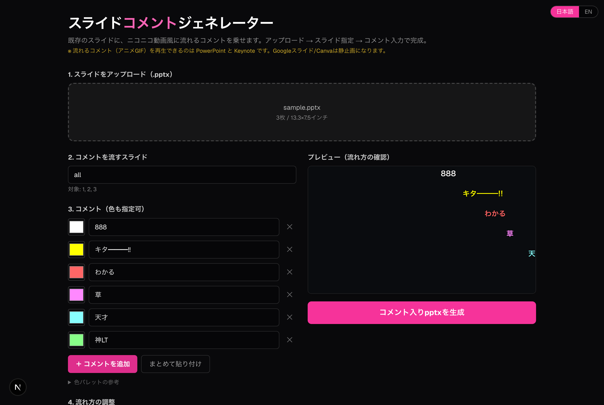
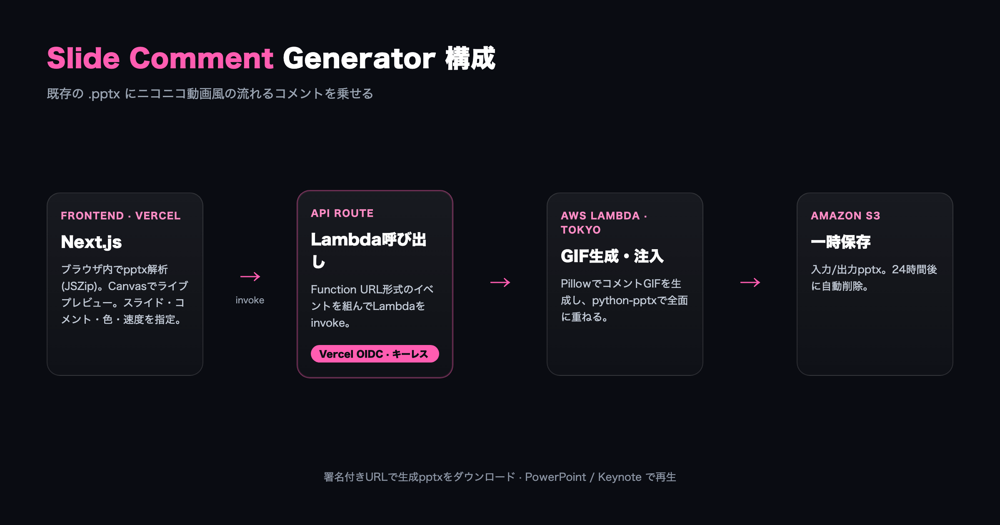

# スライドコメントジェネレーター

既存のスライド（.pptx）に、ニコニコ動画風に右→左へ流れるコメントを乗せるWebアプリ。

**本番:** https://nico-comment-app.vercel.app



## できること

- pptx をアップロード（ブラウザ内で解析、スライド枚数・サイズを取得）
- コメントを流すスライドを番号指定（`all` / `1,3,5-7`）
- コメントを入力（**色も指定可**、まとめ貼り付けも対応）
- 流れるスピード・出現間隔・行数・文字サイズを調整、Canvasでライブプレビュー
- 「生成」でコメント入り pptx をダウンロード
- **UIは日本語 / 英語を切り替え可能**

## 仕組み

コメントが流れる**透過アニメGIF**を生成し、指定スライドの上に全面で重ねる。
PowerPoint / Keynote はスライドショー時にアニメGIFを自動再生するため、確実に動く
（ネイティブのモーションパスはアプリ依存で再生が不安定なため不採用）。



- **フロント:** Next.js (App Router) on Vercel
- **バックエンド:** Lambda（コンテナ / Pillow + python-pptx + Noto Sans JP）
- **認証:** Vercel OIDC Federation（キーレス、`@vercel/oidc-aws-credentials-provider`）
- **ストレージ:** S3（入力/出力、ライフサイクルで24時間後に自動削除）

アップロードはS3への署名付きPUTで行い、Vercel/Lambdaのペイロード制限を回避して大きめのpptxにも対応。
フロントから直接公開エンドポイントを叩かず、Next.js の API Route が OIDC でロールをAssumeしてLambdaをinvokeするため、長期的なアクセスキーを保持しない。

## 制約

流れるコメント（アニメGIF）を再生できるのは **PowerPoint / Keynote** のみ。
Googleスライドは静止画扱い、Canvaも再生は不確実。
Canva/Googleで作った資料も「pptxエクスポート → 本アプリ → PowerPoint/Keynoteで開く」なら利用可。

## 権利について

ニコニコ動画の「コメントが流れる機能（コメント配信システム）」については運営会社が特許を保有しているとされます。
本ツールは**ネットワークを介さずローカルで完結する演出**であり、ネット経由・サーバー同期・リアルタイムの「配信システム」とは構成が異なります。
ただし用途により判断は異なるため、商用・配信用途では各自で権利関係をご確認ください。詳細はアプリ内の [`/notice`](https://nico-comment-app.vercel.app/notice) を参照。
**生配信などでリアルタイムに届いたコメントを同期表示する用途は想定していません。**

## ローカル開発

```bash
npm install
npm run dev   # http://localhost:3000
```

ローカルではAWSクレデンシャル（`aws login` など）の既定チェーンでLambdaを呼ぶ。

## Lambdaのデプロイ（参考）

```bash
cd lambda
docker build --platform linux/arm64 -t <ECR>/nico-comment-app:latest .
docker push <ECR>/nico-comment-app:latest
aws lambda update-function-code --function-name nico-comment-app --image-uri <ECR>/nico-comment-app:latest
```

環境変数: Lambda側 `BUCKET`、Vercel側 `AWS_ROLE_ARN`。
